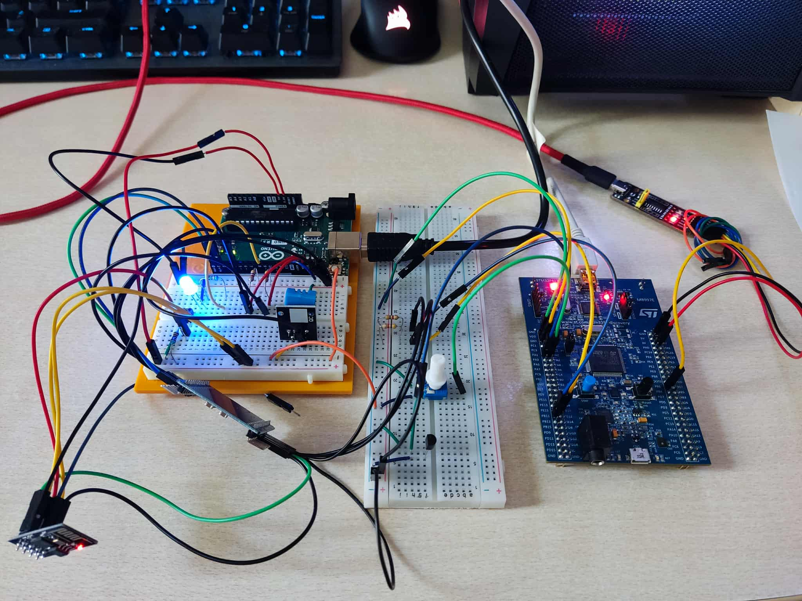
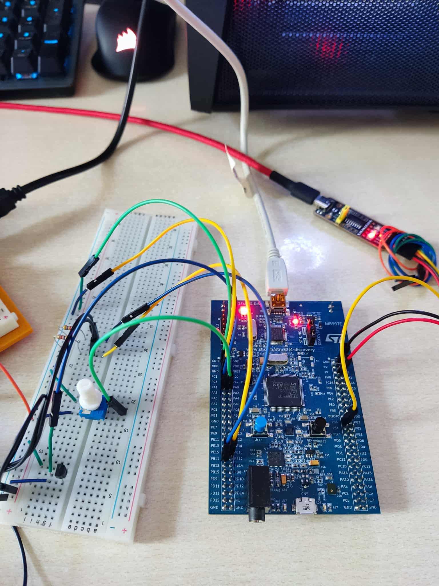
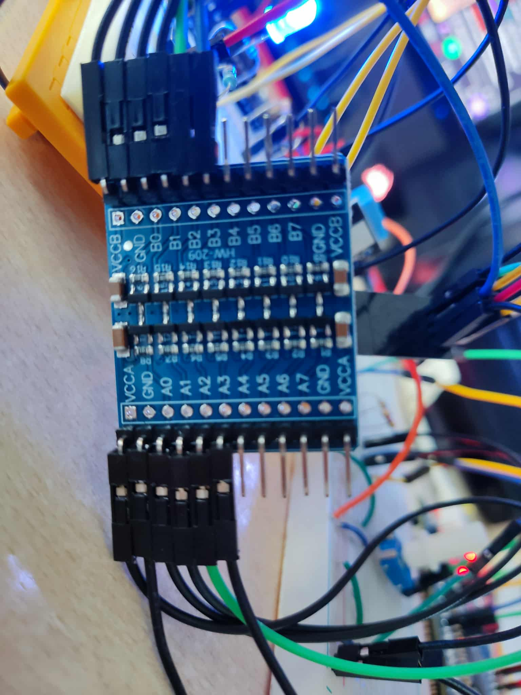
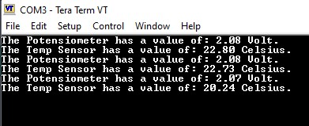
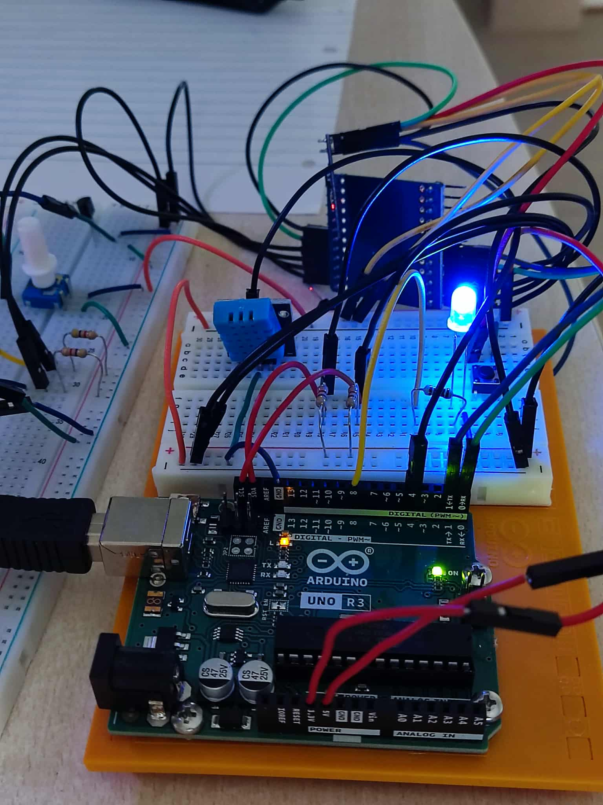
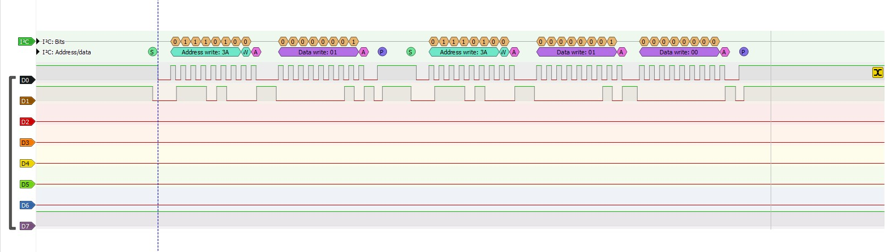
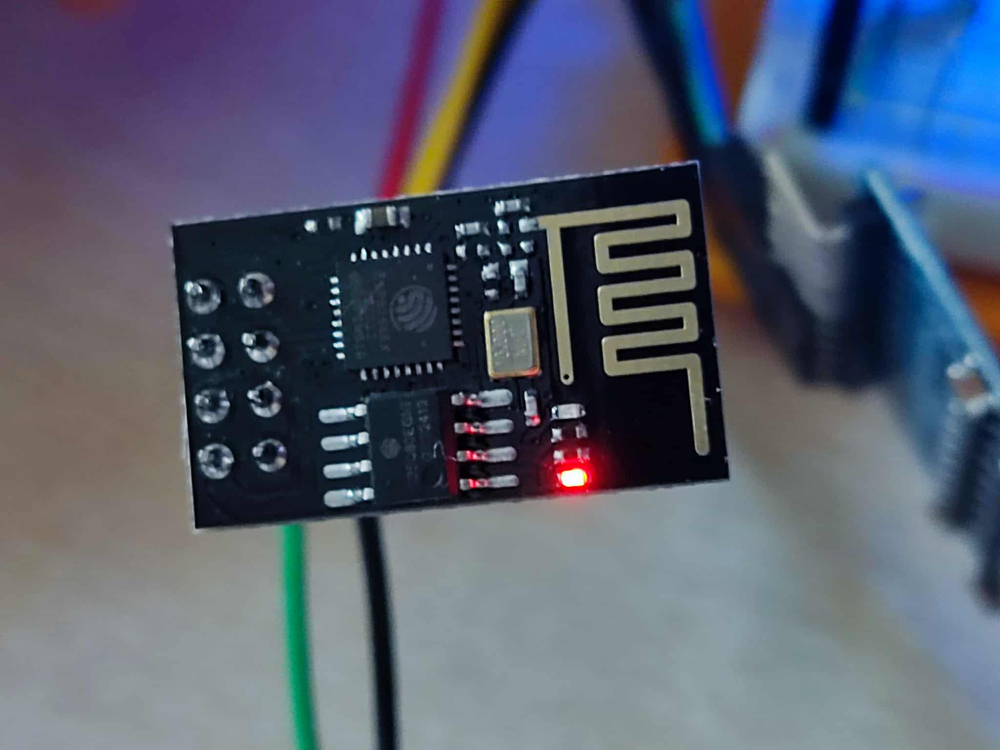
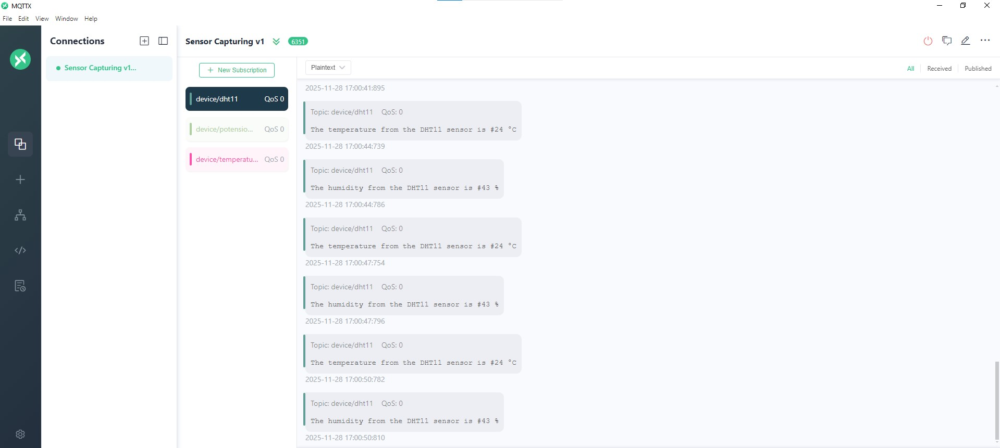
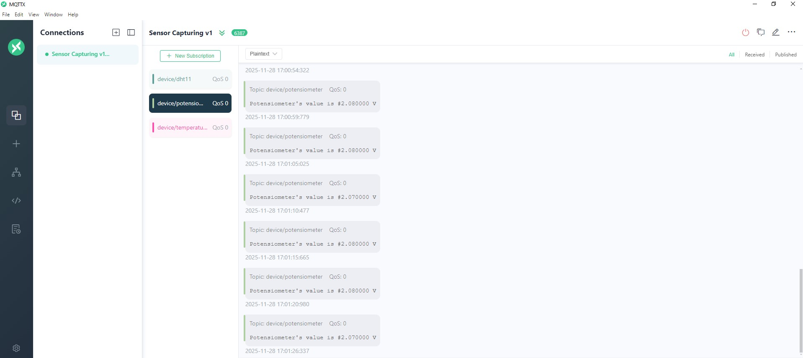
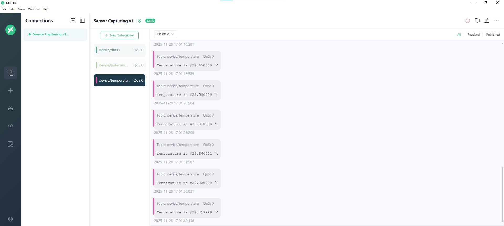

# Sensor Capturing via Microcontrollers

## Summary
In this exercise we will utilise a STM32F407G Discovery board, an Arduino UNO board and an ESP8266 module to capture data and upload them into a MQTT broker. The design includes:
- **<ins>STM32F407G Discovery board</ins>**: Recording of data from a temperature sensor and a potensiometer and forwarding of the data to an Arduino UNO with the I2C protocol through a logic level converter.
- **<ins>Arduino UNO</ins>**: Receiving I2C data, capturing data from a DHT11 sensor and then transmission of the collected data to an ESP8266 module through the UART peripheral.
- **<ins>ESP8266</ins>**: Gathering of all sensor data and upload to a MQTT broker.

## Circuit

## STM32F407G Discovery board
The STM32F407G Discovery board is configured with HSI 8 MHz Clock, ADC1 peripheral, ADC2 peripheral, I2C2 peripheral, USART1 peripheral and TIM2 peripheral.
* The ADC1 peripheral is responsible for capturing data from the Potensiometer from Channel 0(A0 pin).
* The ADC2 peripheral is responsible for capturing data from the Temperature sensor from Channel 1(A1 pin).
* The USART1 peripheral(115200 Baud Rate) is responsible for sending the captured data to the PC through a UART -> USB converter connected at PB6 pin. This is how the correctness of the captured data is confirmed from the STM32F407G's side.
* The I2C2 peripheral(100000 kHz) forwards the captured data to the Arduino board through PB10 and PB11 pins(SCL and SDA). The SCL and SDA are pulled to VDD with external 4.7 KΩ resistors and are also connected to a Logic Level Converter to upshift the collected data from the 0 - 3.3V range to the 0 - 5 V range of the Arduino UNO board.
* The TIM2 peripheral fires an interrupt every 5 seconds and gives a signal to the ADCs to capture new data. So, basically data are being captured every 5 seconds.
  
### STM32F407G Discovery board

All the software in STM32F407G Discovery board is designed to perform its actions with **<ins>RTOS</ins>**. Each of the above actions is assigned to a dedicated task to smoothly schedule the operation of the entire circuit.
- The **<ins>Capture_Temp_Sensor_Value_Task</ins>** is notified every 5 seconds from TIM2's interrupt to capture the next Temperature sensor value.
- The **<ins>Capture_Potensiometer_Value_Task</ins>** is notified every 5 seconds from TIM2's interrupt to capture the next Potensiometer value.
- The **<ins>Transmit_Temp_Sensor_Value_Task</ins>** is notified after a new Temperature Sensor data capture from Capture_Temp_Sensor_Value_Task to transmit the data through I2C.
- The **<ins>Transmit_Potensiometer_Value_Task</ins>** is notified after a new Potensiometer Value data capture from Capture_Potensiometer_Value_Task to transmit the data through I2C.

We need to point out that since there are shared resources(UART, I2C, variables for holding the data) the use of **<ins>Semaphores</ins>** has been utilised to prevent conflicts and race conditions.

### Logic Level Converter

### UART output in Tera Term

## Arduino UNO board
The Arduino UNO board is configured with its UART running at 115200 Baud Rate, its I2C running at 100 kHz, Digital Pin 4 to capture from the DHT11 sensor and Digital Pin 8 to write to an LED.
* The UART peripheral is responsible for transmitting the data from the STM32F407G Disc board and from the DHT11 sensor to the ESP8266 module every time new data are availabled. This is determined through specified boolean variables(flags) which take the value "true" every time new data are available and the value "false" after each transmission.
* The I2C peripheral has its SCL and SDA pins pulled to VDD with external 4.7 kΩ pull up resistors. These pins are also connected to the Logic Level Converter to receive the transmitted data from STM32F407G Discovery board.
* Digital Pin 4 is utilised by the DHT11 library to capture new temperature and humidity values from the DHT11 sensor. These values are also transmitted by the UART according to their own flags every time new data are available.
* Digital Pin 8 is responsible for powering on an external LED with ( analogWrite(8, brightness) ) according to the brightness value, which is computed from the received potensiometer data.

### Arduino UNO board

To provide a robust design the inclusion of a **<ins>Watchdog Timer</ins>** has been made to the Arduino UNO board. The watchdog timer refreshes every 4 seconds and in case of an error in our code it resets the system, providing autonomy.

## I2C Transmission - Logic Analyzer

## ESP8266 module
The ESP8266 module uses ESP8266WiFi.h and PubSubClient.h to upload the receiving data from the Arduino UNO to a MQTT broker(test.mosquitto.org). This modules has an external reset button for reseting and its UART TX and RX pins connected to the Arduino's RX and TX through the Logic Level Converter since it operates at 3.3 V(as the STM32F407G does) in comparison with the Arduino which operates at 5 V. The data are published to the MQTT broker to 3 different topics:
* **<ins>device/temperature</ins>** topic: This topic contains the data coming from STM32F407G's Temperature sensor.
* **<ins>device/potensiometer</ins>** topic: This topic contains the data coming from STM32F407G's Potensiometer.
* **<ins>device/dht11</ins>** topic: This topic contains the data coming from Arduino's DHT11 sensor.

### ESP8266 module

The ESP8266 module has also a **<ins>Watchdog Timer</ins>** configured to refresh every 10 seconds to be able to recover from unexpected crushes. The data in the broker are monitored with **<ins>MQTTX</ins>** application.

### MQTTX

